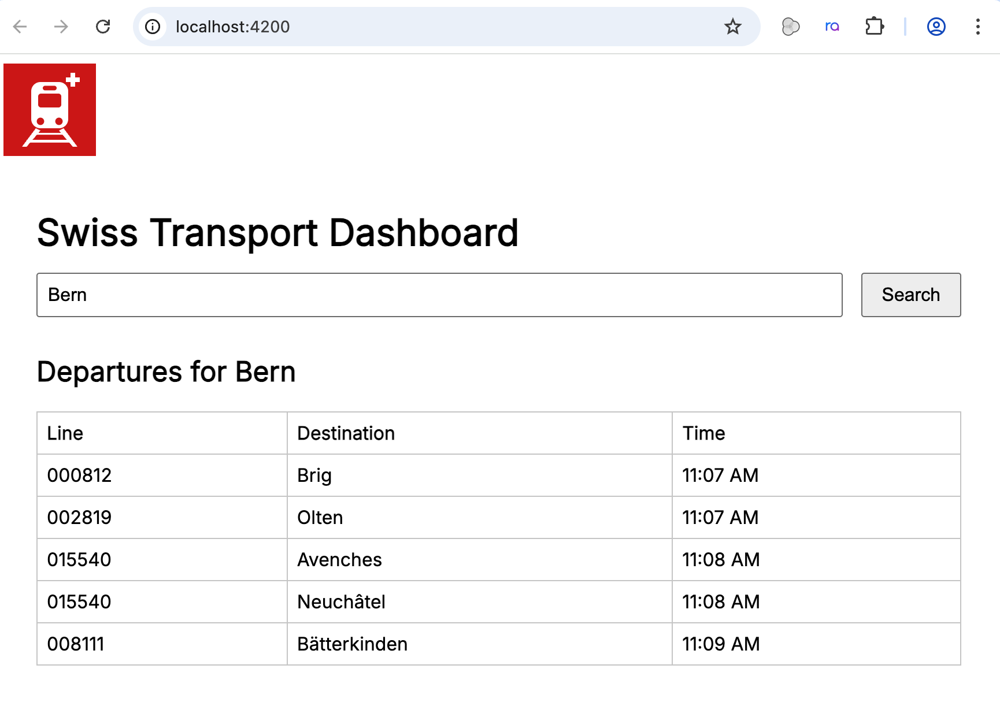
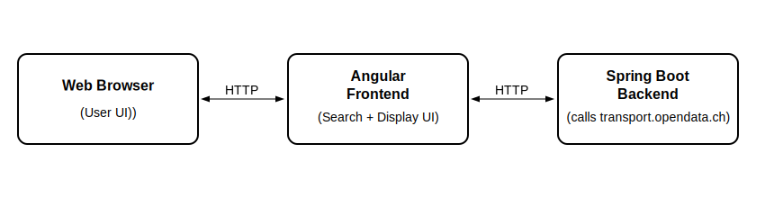

# Swiss Transport Dashboard

This is a demo web application that lets users search for public transport stations in Switzerland and view upcoming
departures using the [transport.opendata.ch](https://transport.opendata.ch) API.

## Features

- Search for stations
- View upcoming departures from a station
- Displays error messages if the backend is unreachable
- Custom SVG logo
- Modern font and visual improvements
- Lightweight Spring Boot backend to interact with the public API
- Responsive Angular frontend (Angular 19)

## Tech Stack

- Java 21 + Spring Boot
- Angular 19 + TypeScript
- RESTful architecture
- Docker-ready

## Running the Application

### Backend (Spring Boot)

```bash
cd backend/
./mvnw spring-boot:run
```

### Frontend (Angular)

```bash
cd frontend/
npm install
ng serve
```

Then open your browser at: http://localhost:4200

## Screenshot



## Architecture

